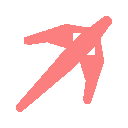

# Grappling hook add-on for Godot 4.x 3D

**Destro-hook is an add-on that simplifies the creation of a spring based grappling hook mechanic in Godot 4.x 3D**

This reposetory includes all the tools you need to add a grappling hook mechanic to your game, aswell as a scene with the grappling hook system and a character controler already implemented.

## FEATURES
- spring based grappling hook system similar to how it works in unity with a custom node for easier implementation
- smoothed character controler
- shader to make the rope wiggle

## REQUIREMENTS
before you can use the system you must add a few actions to the input map with the following names

for character controler
- move_forward, move_backward, move_right, move_left

for grappling hook
- action_jump, LMB (left mouse button), MWU (mouse wheel up), MWD (mouse wheel down)

you can also opt to not do that and instead change the action names in code or in the export variables

** NOTE: the grappling system works best when using a smoothed controler for the player, a non smoothed controler will cause undesired movement and effects. Because of this, I included my own basic character controler.

## HOW TO USE:
Under scenes you can find example_hook.tscn which has everything already set up.

Otherwise it's easy to setup, as you just need to add a new node to the player named "HookController"
After the HookController is added, you just need to add your input names to the export variables, add the hook scene (the scene with the hook and rope) to the export variable, add a raycast to the player that shoots from the players camera and add it to the export variable and finally the hook source, which is a Node3D/Marker3D where the rope will connect.
